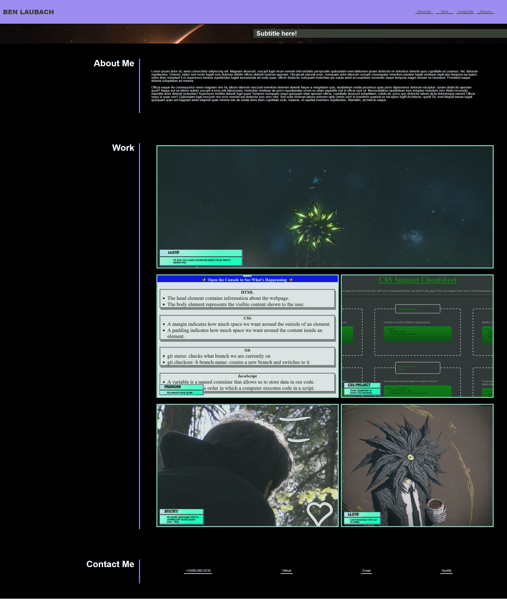

# My First Portfolio

## Description

This project was to attempt to create a more professional single-page portfolio that could be updated as time goes along to show other projects to a potential employer. Currently, there are a few images that will be replaced that are placeholders, the "Lloyds". This solves the current issue of not having a portfolio. I learned quite a bit about CSS over the course of working on this website, and has shown me that there is a ton more to learn still! I learned about grid, and a lot about flexbox, and have a basic understanding of how the two work.

## Installation

No installation required. Just visit the [link here](https://blaubachs.github.io/my-portfolio/) for the deployed site.

## Usage

Visit the link above in the installation section. Elements in the header will jump the page to their respective sections. 
* Cards that reference a specific project will link to that deployed project. 
* Links in the footer section will link to their respective profiles.

## Credits

Several bootcamp students helped troubleshoot CSS issues in my project.

Midjourney is an AI art tool that I used to generate one of the images inside of the work section:
[Midjourney](https://www.midjourney.com)

This YouTube channel had several tutorials that I had watched to help me understand these elements more:
[Kevin Powell's YouTube Channel](https://www.youtube.com/channel/UCJZv4d5rbIKd4QHMPkcABCw)

## License

No license.

## Features

* The elements in the header will jump the page to their respective sections, and will change cover when the mouse hovers over them. 
* Cards that reference a specific project will link to that deployed project in a new tab.
* Links in the footer section will link to their respective profiles, will glow on hover, and should grow a slight amount.
* Hovering over project cards will cause the mask over them to disappear, and the tile to grow a slight amount.
* The website will change orientation when the screen width gets small enough, and is compatible with mobile.
